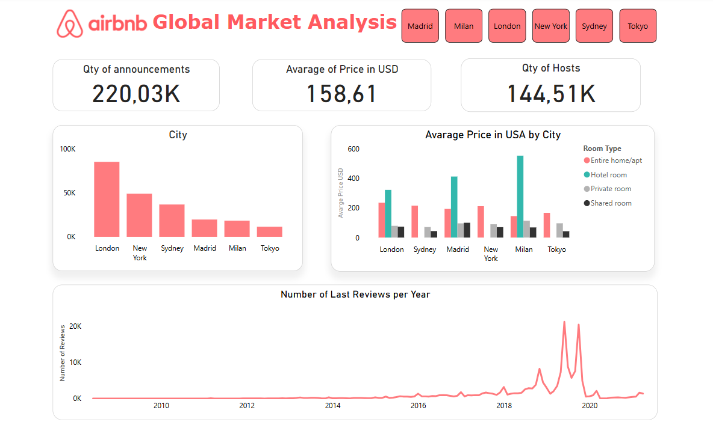

<p align="center">
  
</p>

<h1 align="center" style="color: #FF5A5F;">Comprehensive Airbnb Market Analysis</h1>

<p align="center">
  Global & Madrid Focus • Business-Oriented Insights • Free Deployment via Docker & Power BI
</p>

---

## 🧭 Table of Contents

- [📌 Project Overview](#-project-overview)
- [📊 Key Insights](#-key-insights)
- [🎯 Strategic Takeaways](#-strategic-takeaways)
- [🛠️ Tools & Technologies](#-tools-&-technologies)
- [✍ Instructions](#-instructions)
- [📁 Project Structure](#-project-structure)
- [🌍 Dashboard Deployment](#-dashboard-deployment)
- [⚠️ Data Reliability](#️-data-reliability)
- [👩‍💻 Contributors](#-contributors)

---

## 📌 Project Overview

This repository presents an executive-level analysis of over **220,000 Airbnb listings** from **six global cities** (Madrid, Milan, London, New York, Sydney, Tokyo) spanning **2010–2020**.  
The goal: to extract actionable insights for **hosts, guests, and investors** by exploring pricing, availability, demand signals, and property types.

The final output includes a **Power BI dashboard**, **free-to-deploy with Docker & Nginx**, designed to make exploration intuitive and scalable.

---

## 📊 Key Insights

### 💡 Market Dynamics

- **Availability Drives Price**  
  Listings with >180 days availability are priced higher — hosts favor revenue per stay over occupancy volume.

- **Location = Value**  
  In Madrid, areas like **Retiro**, **Centro**, and **Arganzuela** command the highest prices. **Chamartín** and **Latina** are more budget-friendly.

- **Type Influences Revenue**  
  Hotel rooms top the price ladder, followed by entire homes. Private and shared rooms are significantly cheaper.

- **Popularity ≠ Premium**  
  More reviews don’t mean higher prices. Affordable listings often have higher review counts — popularity stems from accessibility, not exclusivity.

### 🌍 Global Perspective

- **Average Price:** ~$158 USD, with wide dispersion
- **Most Listings:** London leads volume; Tokyo is the most affordable
- **New York:** Higher prices, more reviews
- **Private Rooms:** High review rates, budget-friendly
- **Hotels:** Expensive but not necessarily well-reviewed

---

## 🎯 Strategic Takeaways

- **Hosts:** Price higher in premium locations and offer entire units for better ROI.
- **Guests:** Choose shared/private rooms and non-central zones for better value.
- **Investors:** Target full-home listings in high-demand neighborhoods for maximum yield.

---

## 🛠️ Tools & Technologies

### 🔎 Data Analysis & Cleaning


### 📈 Visualization & Reporting


### 🐳 Deployment


- Interactive dashboard exported as **HTML from Power BI**
- Served via **Dockerized Nginx**
- 100% free to deploy locally or in cloud with no Power BI license required

### 🖥️ Architecture Diagram

---
## ✍ Instructions

In order for you to be able to check the dashboard in the web:
- Clone the repository in your device
```
git clone https://github.com/Yael-Parra/Airbnb-Analysis.git           # Better go check at the link
cd Airbnb-Analysis
```
- You need to have Docker
- You need to have a Nginx account
  - Then you need to put your token as in the .env file example
    
- Now, run as follows from the root of the project:
```
docker-compose --env-file .env up --build      # This is to build it
docker-compose down --rmi all                  # This is to eliminate it
```

---

## 📁 Project Structure

```
Airbnb-Analysis/
├── data/                         # Raw CSV files per city
├── eda/                          # Jupyter notebooks for analysis
├── img/                          # Visual assets (e.g. logo, dashboard screenshots)
├── powerbi-web/
├── processed_data/               # Cleaned and merged datasets
├── scripts/                      # Python scripts for data processing and merging
├── .env.example                  # You must change this with your own token
├── .gitignore
├── Airbnb Dashboard.pbix         # Power BI report source file
├── Dockerffile
├── Report Analysis Airbnb.pdf    # Executive PDF report (optional shareable version)
├── README.md
├── docker-compose.yaml
└── requirements.txt              # Python dependenciesREADME.md

```

---

## 🌍 Dashboard Deployment

<p align="center">
  <table>
    <tr>
      <td></td>
      <td></td>
    </tr>
  </table>
</p>

- Dashboard features filters by **city**, **neighborhood**, **accommodation type**, **price ranges**, and **availability**
- Mobile-optimized, highly visual, business-ready

> 🧪 `.pbix` and exported HTML included — no Power BI service needed.

---

## ⚠️ Data Reliability

The dataset has undergone **extensive cleaning**: missing data handling, price normalization, text unification, and suspicious entry filtering.  
However, variables like `last_review` and some geo fields are partially imputed — interpret with light caution.

---
## 👩‍💻 Contributors

We’re open to **collaborations**, **freelance opportunities**, or simply connecting to share ideas and perspectives.  
🤝 *Let’s connect and explore data possibilities together. Whether it's a creative project or a bold idea, we’d love to hear from you.*


| Name | GitHub | LinkedIn |
|------|--------|----------|
| **Abigail Masapanta** | [](https://github.com/abbyenredes) | [](https://www.linkedin.com/in/abigailmasapanta/) |
| **Andrea Alonso** | [](https://github.com/andalons) | [](https://www.linkedin.com/in/andrea-alonso-g/) |
| **Andreina Suescum** | [](https://github.com/mariasuescum) | [](https://www.linkedin.com/in/andreina-suescum/) |
| **Yael Parra** | [](https://github.com/Yael-Parra) | [](https://www.linkedin.com/in/yael-parra/) |


